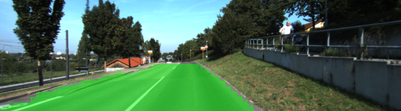
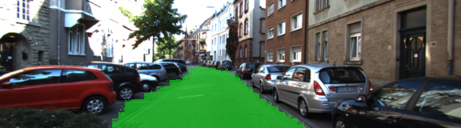

# Semantic Segmentation
### Introduction
In this project, I label the pixels of a road (semantic segmentation) in images using a Fully Convolutional Network (FCN).
 - [FCN-8 architecture](https://people.eecs.berkeley.edu/~jonlong/long_shelhamer_fcn.pdf) 
 - [talk from the authors](http://techtalks.tv/talks/fully-convolutional-networks-for-semantic-segmentation/61606/)

### Setup
##### Frameworks and Packages
Make sure you have the following is installed:
 - [Python 3](https://www.python.org/)
 - [TensorFlow](https://www.tensorflow.org/)
 - [NumPy](http://www.numpy.org/)
 - [SciPy](https://www.scipy.org/)
##### Dataset
Download the [Kitti Road dataset](http://www.cvlibs.net/datasets/kitti/eval_road.php) from [here](http://www.cvlibs.net/download.php?file=data_road.zip).  Extract the dataset in the `data` folder.  This will create the folder `data_road` with all the training a test images.

### architecture

### Run

Run the code in the `main.py` module.
Output, labeled images are written to the `runs` directory

### Tips
- Batch size and learning rate are linked. If the batch size is too small then the gradients will become more unstable and would need to reduce the learning rate.
- This finetuned VGG model is segmenting lanes to human-level accuracy. Wonder what will happen when trained on a much deeper network (think resnet?).
- Try it on the Cityscapes [dataset](https://www.cityscapes-dataset.com/) (need a GPU with at least 10 TFlops)

### Sample output images

